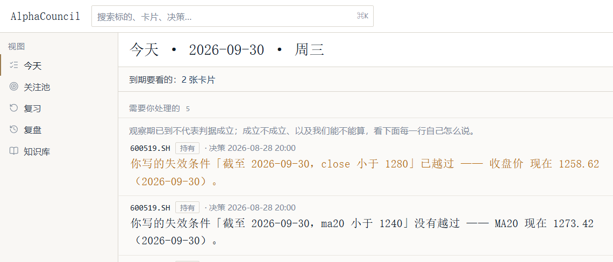
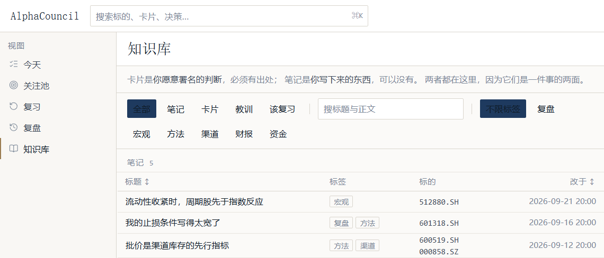
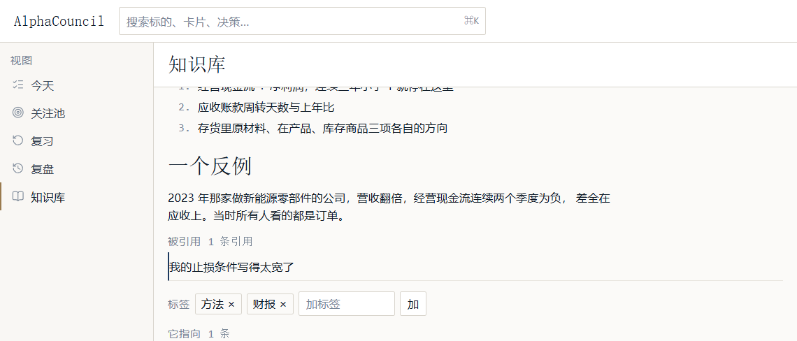
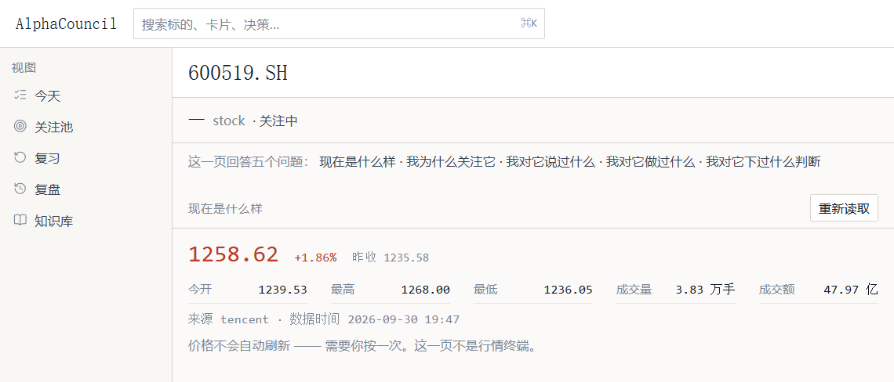
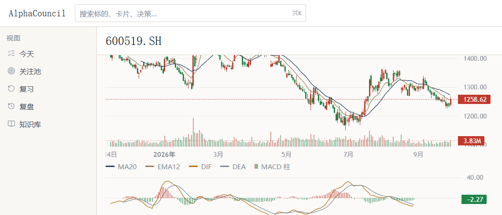
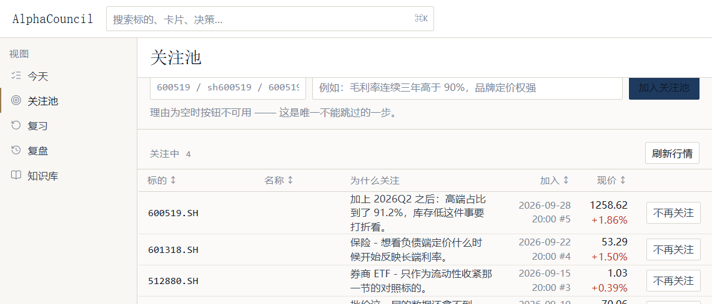
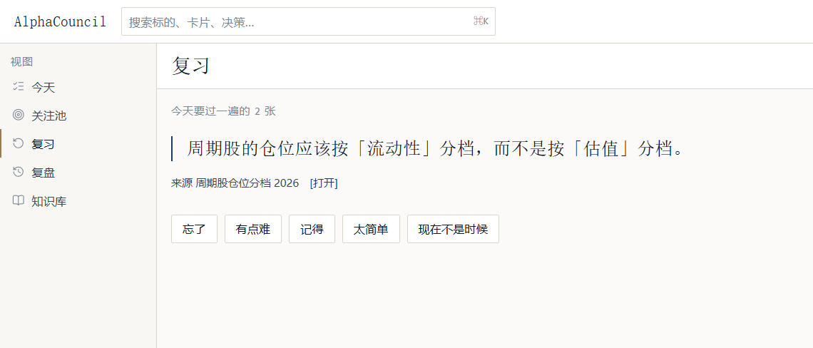
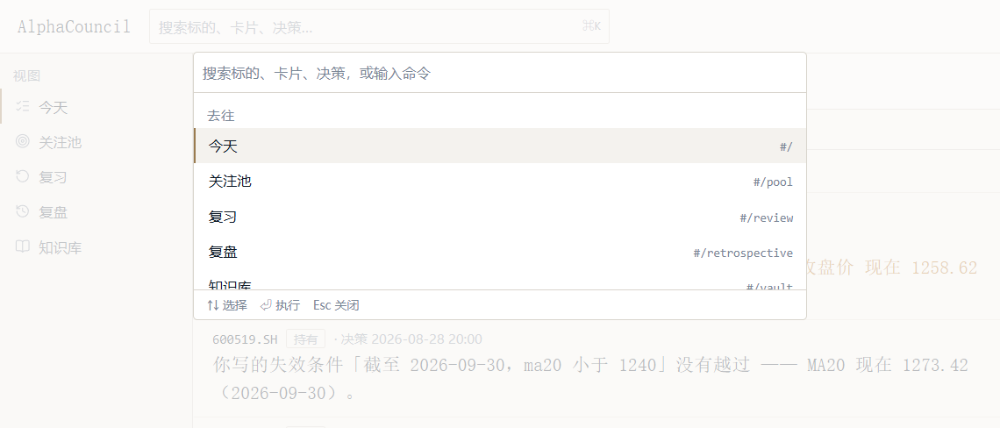

# AlphaCouncil

> **Investing is a practice, not a prediction.**
>
> A knowledge system for people who trade A-shares. It puts the data about one
> instrument, the judgements you wrote down, and what happened to those judgements
> on the same page.
> Append-only decision log · spaced repetition · a quality quadrant for decisions ·
> it optimises your process, never your return forecast

**中文** | [English](README.en.md)

[](https://github.com/wqadlw/alphacouncil/actions/workflows/ci.yml)
[](https://www.python.org/downloads/)
[](LICENSE)

<!-- The screenshots are real: a real backend, a real SQLite file, real quotes from
     tencent (600519.SH, 2026-09-30 19:47), and a K-line the product drew itself.
     The records in them are a seeded demo set, not the author's own positions, and
     the seed text deliberately obeys red line 1 (no price targets, no forecasts,
     no buy/sell advice) — because `S-03` is a gate, and a README's pictures
     should not be able to turn the build red.
     Full Chinese README with more screenshots: README.md -->



> The first line of that screenshot reads: **「你写的失效条件『截至 2026-09-30,
> close 小于 1280』已越过 —— 收盘价 现在 1258.62」** — *the invalidation condition you
> wrote has been crossed; the close is now 1258.62.*
>
> That one line is the product. **You write down the sentence that should
> disprove you, and then it comes looking for you — not the price.**

---

## 1. What it is

Three things, one page:

| | what it is | provenance |
|---|---|---|
| **Card** | a judgement you are willing to sign | **a source is required** |
| **Note** | something you wrote down | may have none |
| **Decision** | one action + rationale + counter-evidence + **an invalidation condition** | timestamped by the server |

That asymmetry — a card needs a source, a note need not — is the premise of the
whole knowledge base, so it lives in the **input's placeholder text** and not only
in a document:



What a working investor actually lacks is not data. It is **nowhere to put "what
I was thinking at the time"**. This puts those three things next to the quotes, so
that *what you said* and *what happened afterwards* can be lined up.

## 2. The interface

**A note** — rendered Markdown, plus who cites it and what it cites



**One instrument** — answers five questions: where is it now, why do I follow it,
what have I said about it, what have I done, what have I decided



The chart is drawn by the product (`lightweight-charts`), **A-share convention: red
up, green down**



> **Prices do not refresh themselves — press once. This page is not a quote
> terminal.**
> Source and timestamp are stated per reading: `tencent` · `2026-09-30 19:47`.
> **No data renders empty, never `0`** (red line 6, guarded by `S-08`).

**Watchlist** — the reason is mandatory, because a reason is not a note-to-self



> **You follow things, and why you follow them. The reason is not a comment — it
> is the sentence you will have to face when someone asks you six months from now.**

Revising the reason for the same ticker does not overwrite it. The watchlist is an
**event log plus a current view** (`watchlist_current` is a VIEW, not a table).

**Review** — FSRS spaced repetition, with copy that puts the reader first



The four buttons are **忘了 / 有点难 / 记得 / 太简单 / 现在不是时候** — *forgot / hard /
remembered / easy / not now.* There is no "failed" and no "start over" here: those
two words score the reader instead of describing what happened. `again` is pinned
by spec 028 to mean "**my mind changed**", not "I forgot".

**Command palette** — `Ctrl` + `K`



> The nav behind the palette is dimmed — that is the three things a modal owes
> you: remember the original focus, keep Tab inside, mark the background `inert`.
> They live in one hook (`useModalFocus`) because `CommandPalette` was the only
> component that needed them, and an abstraction with one caller eventually
> gets inlined back.

## 3. Decisions specific enough to quote

`docs/` and `.ai/` say more about this project than the code does. Four of them,
taken verbatim from the interface, because they *are* the design:

1. **An immature result renders empty, not `0` and not `—`** (red line 6, `S-08`).
   An MA20 drawn from five bars is a line through the present that a chart will
   happily render so it is not drawn.
2. **An invalidation condition cannot be a sentence, at the schema level.**
   `metric` must match `lowercase letters, digits and underscores` — a
   **machine-readable field name** — plus an operator, a threshold and an `as_of`.
   The API rejects "sell if the fundamentals deteriorate".
3. **Append-only is not a convention, it is 24 database triggers**:
   `decisions_no_delete`, `note_reviews_no_delete`, … A `DELETE` on an
   append-only table is not a slow query, **it is an error**. Changing your mind
   appends a row too.
4. **The home page does not push.** No red dot, no count, no "3 cards waiting" on a
   nav item. A badge turns "you owe three cards" into a number you can see and
   climb. The today page does not headline "you have 5 things to handle"; it
   headlines **which invalidation condition you wrote has come due**.

## 4. Stack

| | |
|---|---|
| Backend | Python 3.12+ · FastAPI · Pydantic v2 · SQLAlchemy 2 · SQLite (FTS5 / trigram) · fsrs · structlog |
| Frontend | React 19 · Vite · Tailwind CSS v4 · lucide-react · lightweight-charts |
| Data | Tencent · Sina · Eastmoney (quotes and daily bars) |
| Runtime deps | **9 Python packages · 10 npm packages** (named one by one by the `V-07` gate) |
| Size | 74 commits · 41.9k lines of Python · 18.1k lines of frontend · 22.0k lines of `.ai/` · 12 migrations · schema v12 |

**No LLM dependency.** No `openai`, no `langchain`, no `langgraph` in
`pyproject.toml` — and the `OPENAI_API_KEY` in `.env.example` is there for a
future that has not arrived. That is deliberate; ADR-0027 records LangGraph and
fastmcp as **adopted, not built**.

## 5. Run it

```bash
git clone https://github.com/wqadlw/alphacouncil.git
cd alphacouncil

# backend
python -m venv backend/.venv
backend/.venv/Scripts/pip install -e "backend[dev]"      # Windows
backend/.venv/bin/pip    install -e "backend[dev]"      # macOS / Linux

# frontend
cd frontend && npm install && cd..

# two terminals
backend/.venv/Scripts/python -m alphacouncil            # API → 127.0.0.1:8000
cd frontend && npm run dev                              # → 127.0.0.1:5173 (/api proxied)
```

The database lands in `%LOCALAPPDATA%\AlphaCouncil\`, is migrated on first run, and
**the app starts with no network at all** — the quotes are simply empty.
Settings are in `.env.example`; never commit `.env`.

## 6. The gate

`dev.py check` runs **11 steps**, and locally it runs the same list CI does a
missing step is a failure.

```
lint · typecheck · licenses · check-static · test · test-integration
frontend-typecheck · frontend-lint · frontend-test · frontend-build · e2e
→ ran 11 · passed 11 · failed 0
```

Current numbers (2026-09-30, green on one machine):

```
backend unit 1333 · integration 43 · frontend 182 · E2E 101 · static checks 15/15
```

**The 15 static checks are not style checks.** They guard **code that should not
exist** a test can prove the paths it walks behave, and can never prove that
nobody added a second HTTP client so `S-01…S-15` guard, among other things: the
single HTTP entry point, append-only on the decision log, error codes registered,
**both directions of the dependency budget** (an approved package must be
imported; an import must be declared), and **that no source file contains
mojibake**.

```bash
cd backend && .venv/Scripts/python scripts/dev.py check
```

## 7. Status, including what is missing

The most convincing part of a README is the part that admits what it does not have.

**Built**: 5 pages · **1 launch screen** · 12 migrations · 43 API endpoints ·
FTS5 search · the decision log and its quality quadrant · review scheduling for
cards and notes · charts and quotes · the command palette · 15 static checks · an
11-step gate.

**The 31 paintings on the launch screen** (`.ai/memory/decisions.md` ADR-0033) —
CC0 holdings from the Cleveland Museum of Art, ink landscapes from the Song and
Yuan dynasties through the Qing, one per day of the month. Per painting, the
artist, date, title, medium, **accession number** and museum link are in
`frontend/src/art/scroll/PROVENANCE.md`, and that file is **a receipt, not a
claim**. The first generator wrote all 31 with no accession number and no source
URL — it read the API's `accession_number` against a cache that stores
`accession` — so the images were right and the gate was green and the words
「public domain」 had nothing behind them. Four assertions now watch that.

**⭐ This section has been edited, so it should say why it still holds.** ADR-0033
reversed 「zero entrance animation」 and 「the interface is the product, not a
landing page」, and a repository that just overrode its own rules should be the
first to be doubted on the sections still claiming to be honest. It holds,
because every line here is a **fact** and not a rule: 「pywebview is not built」
does not become built because somebody changed their mind, and 「`Drawer` has no
callers」 does not gain callers because building it was approved. **What was
reversed is a judgement; facts are not affected.** The only honest edit to this
section is to add to it.

**Adopted, not built** (each recorded in `.ai/`, each with a reason):

- **Multi-agent orchestration** (LangGraph / fastmcp) — ADR-0027. *The
  previous version of this README described exactly that* **and it is not what
  this project is** — every screenshot on this page came from the current
  code.
- **The desktop shell** (pywebview) — **not a dependency**. The pages assume
  the desktop shape (a static bundle, hash routing, one process); the shell is not
  built.
- **Filings and financial-statement sources** (D4 / D5) — quotes and daily bars
  are wired (Tencent / Sina / Eastmoney); filings are not, and the sentence
  「公告与财务数据源尚未接入（D4 / D5）」 is a real line on the today page.
- **Four floating-layer components** (`Drawer`, `Popover`, `Toast`, `DatePicker`)
  — in the spec, surveyed, and with no callers**. `Drawer` and `Popover` do
  not exist, `DatePicker` is two native `<input type="date">`, and all 16 of
  `Toast`'s message sites are errors. Building four components nobody calls is
  the exact failure mode this repository keeps writing down.
- **A WYSIWYG editor** — `@milkdown/*` is approved, installed, **imported by no
  source file**, and ships 0 bytes. Measured cost of wiring it: **+362.82 kB
  (gzip +110.59 kB), JavaScript up 68%** — and the three approved packages
  **cannot read Markdown back out** without a fourth, undeclared one.
  Decision pending: `.ai/memory/decisions.md` ADR-0032.
- **5 of 15 red lines have a runnable verifier** (`dev.py eval`, deliberately
  **not** in the gate — a permanently red gate trains everyone to ignore the
  summary). Baseline in `.ai/eval/redlines.json`.
- **No first-run experience** — no seed, no demo, no onboarding. A new reader sees
  **five empty pages**, and now a full-screen painting in front of them. That is
  the largest gap in the product and this section is not here to excuse it.

**Fixed while writing this README** (the previous version of this file listed it
as outstanding):

- A note's **outgoing** link used to render the raw id while the **incoming** side
  rendered a title. The cause was not a missing title but the title's presence
  depending on the target happening to be in the list on screen — typing in the
  search box turned a link the reader had written into an id. The link row now
  carries the target's own name.
- ⭐ **The gate's CSS scan was walking nothing.** `SRC_DIR` came from
  `URL.pathname` with the leading slash stripped, which on Windows yields
  `/D:/AAA/...`; stripping the slash leaves an **absolute Windows path used as a
  relative one**. It does not throw — it just does not exist, so it fell back to
  the `frontend/` root, and the one stylesheet is at `src/styles/globals.css`.
  Eleven rules written as `for (const file of CSS)` had **never run**. A
  deliberate `@keyframes` in the stylesheet left all 37 tests green.
- ⭐ **The launch screen once blocked the entire e2e suite: 10 passed, 101 failed.**
  That was not a test bug. A reader opening `#/i/sh/600519` from a bookmark has
  asked a specific question, and answering it with a full-screen painting puts the
  app's onboarding above the reader's intent. Deep links now skip it.

## 8. Where the screenshot data came from

All of it is real — a real backend, a real SQLite file, real quotes
(`tencent`, 600519.SH, 2026-09-30 19:47), and a chart the product drew itself.
**The record contents are seed data**, written so as not to breach red line 1
— no price targets, no forecasts, no buy/sell advice, because
`S-03` (`no-prediction-field`) is a gate and a README should not be able to turn it
red. The review schedule is generated by the product's **own** domain functions
(`note_recall.enroll` / `record_review`), so the FSRS state is real — "next
2026-10-03" is not a string somebody typed.

## 9. Documentation

`docs/FRONTEND_STYLE_GUIDE.md` — the interface rules. Its 16 acceptance items
(`V-01…V-16`) are **tests, not prose**, in `frontend/src/styleguide.test.ts`
because prose does not fail a build and that is precisely how the twelve
components the guide asked for once shipped as **zero built**.

`.ai/` — 22k lines, and the real design record:

| | |
|---|---|
| `.ai/constitution.md` | the red lines and the invariants |
| `.ai/memory/decisions.md` | 32 ADRs, including the **pending** one |
| `.ai/failure-modes.md` | **178** recorded failures each with how it was found |
| `.ai/specs/` | 45 specs, each with a plan and a record of what happened |
| `.ai/status.md` | the current state, **including what is missing** |

`failure-modes.md` is the most unusual file here it does not record code, it
records **where my judgement was wrong**, and each entry says how it was caught
— `F-154` for instance: a filter matched **zero files** because of a path
separator, and the test still reported 「found 0」 which reads like
"somebody deleted both adapters".

## 10. Licence

[MIT](LICENSE) Dependencies are licence-checked too — the `licenses` step
scans the whole tree (338 packages) and copyleft fails the gate. **No
off-the-shelf knowledge manager is used as a base** (Siyuan / Logseq / AppFlowy /
AFFiNE / Joplin / Trilium are all AGPL/GPL/BSL) — building on one of
them would oblige this product to be open source. The survey is in
`references/research/09`.
