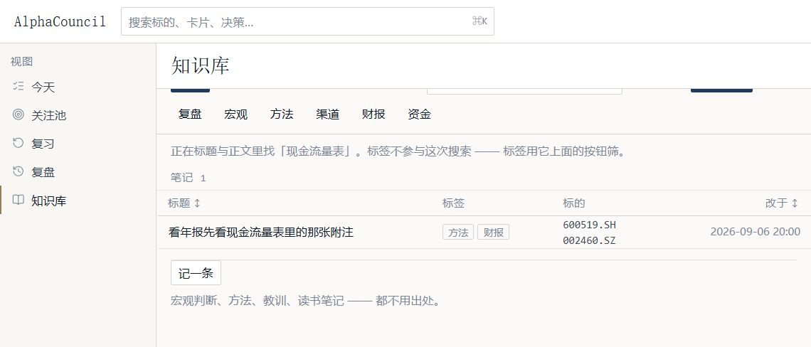
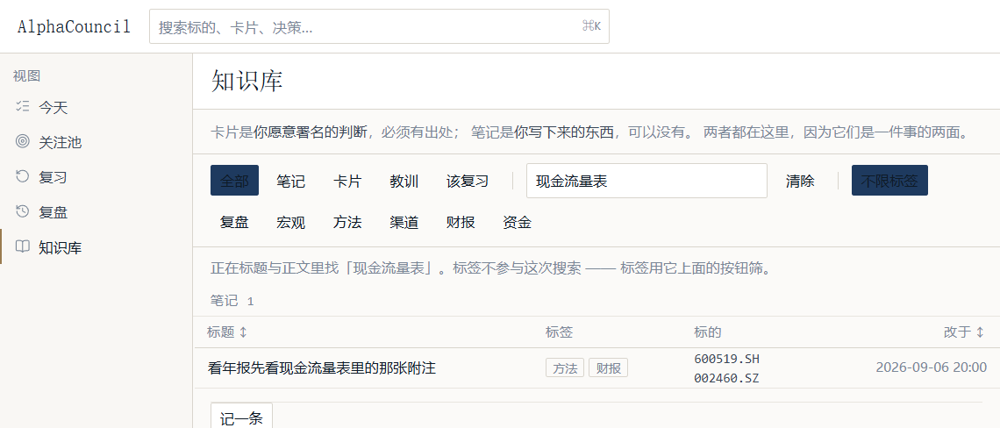

# AlphaCouncil

> 面向实战的股市知识管理系统 · 把一只股票的数据、你写下的判断、以及判断后来的结果放在同一页
> · append-only 决策日志 + 间隔重复 + 决策质量四象限 · **只优化过程，不预测涨跌**

[English](README.md) | **简体中文**

[](https://github.com/wqadlw/alphacouncil/actions/workflows/ci.yml)
[](https://www.python.org/downloads/)
[](LICENSE)

<!-- ⭐ The screenshots are real: a real backend, a real SQLite file, real quotes from
     tencent (600519.SH, 2026-09-30 19:47), and a K-line the product drew itself.
     ⭐ The records in them are a seeded demo set, not the author's own positions ⭐ -
     ⭐ and the seed text deliberately obeys 红线 1 ⭐ (no 目标价 / 涨跌预测 / 买卖建议).
     ⭐ See 「截图里的数据从哪来」 below. -->


> 上面这张图里，第一行写着：**「你写的失效条件『截至 2026-09-30，close 小于 1280』已越过 —— 收盘价 现在 1258.62」**。
> 这个产品最核心的一件事就是这一行：**你写下你期待被推翻的那句话，然后由它来找你，不是由价格来找你。**

---

## 一、这是什么

三样东西，一个页面：

| | 是什么 | 出处 |
|---|---|---|
| **卡片** | 你愿意署名的判断 | ⭐ **必须有出处** |
| **笔记** | 你写下来的东西 | 可以没有 |
| **决策** | 一次动作 + 理由 + 反面证据 + **失效条件** | 时间戳由服务端盖 |

「卡片必须有出处、笔记可以没有」这条不对称，是整个知识库的立足点 —— 所以它被写进了**输入框的提示里**，而不只是文档：



一个 A 股投资者真正缺的不是数据，是**「我当初是怎么想的」这件事没有地方放**。这个产品把这三样东西和行情放在同一页，
让「我说的」和「后来发生的」能对上。

## 二、界面

**知识库** —— 卡片与笔记并列，FTS5 全文检索（中文按 trigram 分词）


检索的语义写在了结果上方：**标签不参与这次搜索 —— 标签用它上面的按钮筛。**



笔记正文是**渲染后的 Markdown**，并列出谁引用了它、它引用了谁


**一只股票** —— 回答五个问题：现在是什么样 / 我为什么关注它 / 我对它说过什么 / 我对它做过什么 / 我对它下过什么判断


K 线是产品自己画的（`lightweight-charts`），**A 股约定：红涨绿跌**


> **价格不会自动刷新 —— 需要你按一次。这一页不是行情终端。**
> 数据源与时间逐项标出：来源 `tencent` · 数据时间 `2026-09-30 19:47`。**没有数据时显示空，不显示 0**（红线 6）。

**关注池** —— 理由是必填的，因为理由不是备注


> **你关注什么，以及你为什么关注它。理由不是备注，是半年后你被追问时要面对的那句话。**

同一只标的改过理由，旧的那条不会被覆盖 —— 关注池是**事件日志 + 当前视图**（`watchlist_current` 是一个 VIEW，不是表）。

**复习** —— FSRS 间隔重复，评分的措辞以读者为先


四个按钮是 **忘了 / 有点难 / 记得 / 太简单 / 现在不是时候**。
⭐ 这里没有「失败」和「重来」：那两个字是在给读者打分，而不是在描述发生了什么。
⭐ `again` 的含义被 spec 028 钉死为「**我的想法变了**」，不是「我忘了」。

**命令面板** —— `Ctrl` + `K`


> 截图里左侧导航被压暗了 ⭐ 那是模态三件套：记住原焦点、Tab 陷阱在面板内、背景 `inert`。
> ⭐ 这三件事抽成了一个 hook（`useModalFocus`），因为 CommandPalette 曾经是唯一需要它的组件，
> ⭐ 而「只有一个人用的抽象」迟早会被内联回去。

## 三、几个具体到可以引用的决定

这个项目的文档（`.ai/`，22k 行）比代码更能说明它 ⭐⭐ 下面四条都是从界面文案里原样拿的，因为它们**是**设计：

1. **未成熟的结果显示空，不显示 `0` 或 `—`**（红线 6，`S-08` 门禁守着）。
   一张还没长够 20 根 K 线的 MA20 画出来是一条线穿过的假象 ⭐ 所以它不画。
2. **止损条件在 schema 层就不能是一句话**：`metric` 必须是
   `lowercase letters, digits and underscores` ⭐ —— 一个**机器可读的字段名**，
   加一个比较符、一个阈值、一个 `as_of`。⭐ 「基本面恶化则止损」这句话，API 直接拒收。
3. **append-only 不是约定，是 24 个数据库触发器**：
   `decisions_no_delete`、`note_reviews_no_delete`…… ⭐ `DELETE` 一张 append-only 表
   不是慢查询，**是报错**。⭐ 连「改主意」也是追加一条新记录。
4. **首页不推送。** 导航上没有红点、没有数字、没有「3 张卡片等着你」。
   ⭐ 徽章会把「你欠三张卡片」变成一个你能看见并攀爬的数字。
   ⭐ 今天的首页不显示「你还有 5 件事没处理」作为标题，它显示的是
   ⭐ **你写下的哪一条失效条件到期了**。

## 四、技术栈

| | |
|---|---|
| 后端 | Python 3.12+ · FastAPI · Pydantic v2 · SQLAlchemy 2 · SQLite（FTS5 / trigram）· fsrs · structlog |
| 前端 | React 19 · Vite · Tailwind CSS v4 · lucide-react · lightweight-charts |
| 数据源 | Tencent · Sina · Eastmoney（行情与日线） |
| 运行时依赖 | **9 个 Python 包 · 10 个 npm 包**（`V-07` 门禁按名字点名守着） |
| 规模 | 74 次提交 · Python 41.9k 行 · 前端 18.1k 行 · `.ai/` 22.0k 行 · 12 个迁移 · schema v12 |

⭐ **没有 LLM 依赖。** `pyproject.toml` 里没有 `openai`、没有 `langchain`、没有 `langgraph`
—— 而 `.env.example` 里的 `OPENAI_API_KEY` 是**为将来准备的**，当前代码不读它。
⭐ 这是一个刻意的选择，理由记在 ADR-0027：LangGraph 与 fastmcp **已采纳、未构建**。

## 五、跑起来

```bash
git clone https://github.com/wqadlw/alphacouncil.git
cd alphacouncil

# 后端
python -m venv backend/.venv
backend/.venv/Scripts/pip install -e "backend[dev]"      # Windows
backend/.venv/bin/pip    install -e "backend[dev]"      # macOS / Linux

# 前端
cd frontend && npm install && cd ..

# 两个终端
backend/.venv/Scripts/python -m alphacouncil            # API → 127.0.0.1:8000
cd frontend && npm run dev                              # → 127.0.0.1:5173（/api 已代理）
```

数据库落在 `%LOCALAPPDATA%\AlphaCouncil\` ⭐ 首次启动自动迁移 ⭐ **不联网也能起**，
只是行情会是空的。设置项见 `.env.example`；`.env` 不要提交。

## 六、门禁

`dev.py check` 跑 **11 步**，本地与 CI 跑的是同一份清单 ⭐⭐ 少一步都算失败。

| 步 | 是什么 |
|---|---|
| `lint` · `typecheck` | ruff · mypy strict |
| `licenses` | 依赖许可扫描（ADR-0024 / L-06） |
| `check-static` | **15 条静态规则** `S-01…S-15` |
| `test` · `test-integration` | 单元 · 集成（**真迁移、真数据库**） |
| `frontend-typecheck` · `-lint` · `-test` · `-build` | 前端四步 |
| `e2e` | Playwright |

当前状态（2026-09-30，本机全绿）：

```
lint · typecheck · licenses · check-static · test · test-integration
frontend-typecheck · frontend-lint · frontend-test · frontend-build · e2e
→ ran 11 · passed 11 · failed 0

后端单元 1333 · 集成 43 · 前端 182 · E2E 101 · 静态检查 15/15（0 error 0 warning）
```

⭐ **`check-static` 里 15 条规则不是风格检查。** 它们守的是「**不该存在的代码**」⭐⭐
测试可以证明它走过的路径是对的，**永远证明不了没有人加了第二个 HTTP 客户端** ⭐⭐
所以 `S-01…S-15` 分别守着：唯一的 HTTP 入口、决策日志的 append-only、
错误的登记在册、**依赖预算的两个方向**（批准的必须有人 import；import 的必须被声明）、
以及**源文件不能含乱码**。

```bash
cd backend && .venv/Scripts/python scripts/dev.py check
```

## 七、⭐ 项目现状（没做的也在这一节）

一个 README 最有说服力的部分，是它承认自己没有什么。

**已建**：5 个页面 · 12 个迁移 · 43 个 API 端点 · FTS5 检索 · 决策日志与四象限复盘 ·
卡片/笔记的复习排程 · K 线与行情 · 命令面板 · 15 条静态规则 · 11 步门禁。

**已采纳、未构建**（都写在 `.ai/` 里，都有原因）：

- ⭐ **多 agent 编排**（LangGraph / fastmcp）—— ADR-0027 记为「已采纳、未构建」。
  ⭐⭐ 旧版 README 描述的就是这个 ⭐⭐ **它不是这个项目现在的样子** ⭐⭐
  ⭐ —— 本页所有截图都来自当前代码。
- ⭐ **桌面壳**（pywebview）—— `pyproject.toml` 里**没有这个依赖** ⭐
  ⭐ 页面假设了桌面形态（静态包 + hash 路由 + 单进程），但壳本身没建。
- ⭐ **公告与财务数据源**（D4 / D5）—— 行情与日线已接（Tencent / Sina / Eastmoney），
  ⭐ 公告与财报**没有** ⭐ —— 首页那句「公告与财务数据源尚未接入（D4 / D5）」是页面上真实的一行字。
- ⭐ **四个浮层组件**（`Drawer` / `Popover` / `Toast` / `DatePicker`）—— 规格里有，
  ⭐ 调查后**没有调用方** ⭐ —— `Drawer` 与 `Popover` 根本不存在，
  ⭐ `DatePicker` 两处都是原生 `<input type="date">`，`Toast` 的 16 处消息点全是错误。
  ⭐⭐ 所以它们没建 ⭐⭐ —— 造四个没有调用方的组件，就是这个项目反复记录的那个失败模式。
- ⭐ **所见即所得编辑器** —— `@milkdown/*` 已批准、已装、**未被任何源文件 import**，
  ⭐ 出货 0 字节。⭐ 接上它的实测成本：**+362.82 kB / gzip +110.59 kB**（JS 涨 68%），
  ⭐ 且已批准的三个包**单独凑不出「编辑器吐出 markdown」** ⭐ ——
  ⭐ 三条读法都在未声明的传递依赖里。⭐ 决定待裁决，见 `.ai/memory/decisions.md` ADR-0032。
- ⭐ **15 条红线里 5 条有可运行的验证器**（`dev.py eval`，**故意不进门禁** ⭐ ——
  ⭐ 一个长期红的门禁会训练所有人忽略汇总）。基线在 `.ai/eval/redlines.json`。

**本轮修掉的缺陷**（README 上一版把它列在「没做的」里，现在不是了）：
笔记的出向链接曾显示原始 id 而反链那侧显示标题。根因不是「没有标题」而是**标题的显示取决于
当前列表里恰好有那一行** —— 读者在搜索框里打字，他自己写下的引用就变成一串 id。
现在链接行自己带目标的名字，两侧一致。

## 八、截图里的数据从哪来

⭐ 全部是真的 ⭐ —— 真后端、真 SQLite、真行情（`tencent`，600519.SH，2026-09-30 19:47）、
⭐ K 线是产品自己画的。⭐ **但记录内容是种子数据**，⭐⭐ 而且是**故意写成不违反红线 1** 的
⭐ —— 里面没有目标价、没有涨跌预测、没有买卖建议 ⭐⭐
⭐ 否则 `S-03`（`no-prediction-field`）会让门禁变红 ⭐⭐ 而一个 README 的配图不该让门禁变红。

⭐ 种子数据用**产品自己的 domain 函数**生成复习排程（`note_recall.enroll` / `record_review`），
⭐ 所以 FSRS 状态是真的 ⭐ —— 「下次 2026-10-03」不是编出来的字符串。

## 九、文档

`docs/FRONTEND_STYLE_GUIDE.md` —— 界面规范，12 项验收（`V-01…V-16`）在
`frontend/src/styleguide.test.ts` 里是**测试而不是散文** ⭐⭐ 散文不会让构建失败，
⭐⭐ 而这正是规范里那 12 个组件一度**一个都没建**的原因。

`.ai/` —— 这个项目真正的设计记录，22k 行：

| | |
|---|---|
| `.ai/constitution.md` | 宪法：红线与不变量 |
| `.ai/memory/decisions.md` | 32 条 ADR，含**待裁决**的那条 |
| `.ai/failure-modes.md` | **178 条**失败模式 ⭐ 附「怎么发现的」 |
| `.ai/specs/` | 45 个 spec，每个都有 plan 与执行记录 |
| `.ai/status.md` | 现状，**包括没做的** |

⭐ `failure-modes.md` 是这个仓最特别的一个文件 ⭐ 它记的不是代码，是**我判断错过的地方**，
⭐ 每条都写清楚「怎么发现的」⭐⭐ —— 比如 `F-154`：一条过滤器因为路径分隔符
⭐ 匹配到了 **0 个文件**，⭐⭐ 而测试仍然报告「found 0」⭐⭐ 读起来像是「有人删掉了两个适配器」。

## 十、许可

[MIT](LICENSE) ⭐⭐
⭐ 依赖也全查过许可 ⭐ —— `dev.py check` 的 `licenses` 步扫整个树（338 个包），
⭐⭐ 拷贝性许可会让门禁变红 ⭐⭐ 知识管理系统的**整体项目**一个都没用
⭐⭐ （思源 / Logseq / AppFlowy / AFFiNE / Joplin / Trilium 全部 AGPL/GPL/BSL）⭐⭐
⭐ 用它们当底座，这个产品就必须一起开源。调查记录在 `references/research/09`。
